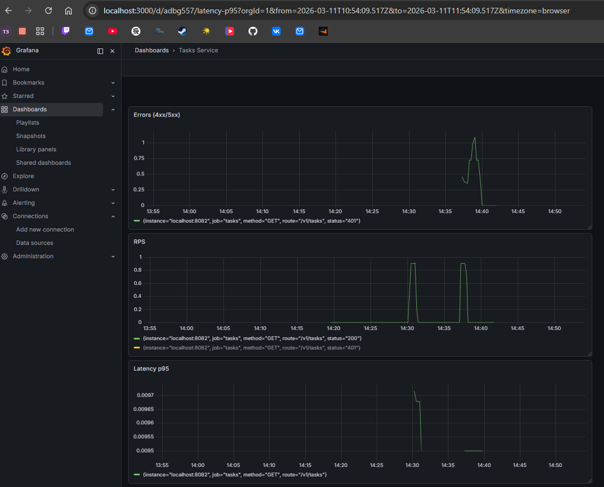

# Практическое задание 4 — Метрики с Prometheus и Grafana

**Выборнов Олег Андреевич, ЭФМО-02-25**

## Описание

Два микросервиса на Go с инструментацией Prometheus и визуализацией в Grafana.

- **auth** (`:8081`) — верификация токенов
- **tasks** (`:8082`) — управление задачами, экспортирует метрики на `/metrics`

## Структура проекта

```
pz4.2/
├── auth/
│   └── cmd/main.go
├── tasks/
│   ├── cmd/main.go
│   ├── internal/
│   │   ├── handler/handler.go
│   │   └── metrics/metrics.go
├── deploy/monitoring/
│   ├── prometheus.yml
│   └── docker-compose.yml
├── images/
│   └── 1.png
├── go.mod
└── go.sum
```

## Метрики

| Метрика | Тип | Описание |
|---|---|---|
| `http_requests_total` | Counter | Общее число запросов (labels: method, route, status) |
| `http_request_duration_seconds` | Histogram | Латентность запросов |
| `http_in_flight_requests` | Gauge | Текущее число активных запросов |

## Запуск

### 1. Сервисы

```bash
# Терминал 1 — auth
cd auth && go run cmd/main.go

# Терминал 2 — tasks
cd tasks && go run cmd/main.go
```

### 2. Prometheus

```bash
cd deploy/monitoring/bin/prometheus
./prometheus.exe --config.file=prometheus.yml
```

Веб-интерфейс: http://localhost:9090

### 3. Grafana

```bash
cd deploy/monitoring/bin/grafana
./bin/grafana-server.exe
```

Веб-интерфейс: http://localhost:3000 (admin/admin)

## Тестирование

```bash
# Успешный запрос
curl -H "Authorization: Bearer test-token" http://localhost:8082/v1/tasks

# Запрос без токена (генерирует 401)
curl http://localhost:8082/v1/tasks

# Просмотр метрик
curl http://localhost:8082/metrics
```

## Grafana Dashboard

Дашборд **Tasks Service** содержит три панели:

- **RPS** — `rate(http_requests_total[1m])`
- **Errors (4xx/5xx)** — `rate(http_requests_total{status=~"4..|5.."}[1m])`
- **Latency p95** — `histogram_quantile(0.95, rate(http_request_duration_seconds_bucket[1m]))`



## Контрольные вопросы

**1. Чем метрики отличаются от логов?**

Метрики — агрегированные числовые показатели (счётчики, гистограммы), собираемые с фиксированным интервалом. Они компактны, хорошо подходят для алертинга и построения трендов. Логи — детальные записи отдельных событий с контекстом. Метрики отвечают на вопрос "сколько/как быстро", логи — "что именно произошло".

**2. Чем Counter отличается от Gauge?**

Counter — монотонно возрастающий счётчик, который никогда не уменьшается (только сбрасывается при рестарте процесса). Используется для подсчёта запросов, ошибок, байт. Gauge — произвольное значение, которое может расти и падать. Используется для текущего числа горутин, загрузки памяти, числа активных соединений.

**3. Почему латентность нужно измерять гистограммой, а не средним?**

Среднее значение маскирует хвосты распределения: 99% запросов могут обрабатываться за 5мс, а 1% — за 10 секунд, но среднее покажет ~105мс и не выявит проблему. Гистограмма позволяет вычислить перцентили (p95, p99), которые показывают реальный опыт большинства пользователей и позволяют обнаружить выбросы.

**4. Что такое labels и опасность высокой кардинальности?**

Labels — пары ключ-значение, которые уточняют метрику (например, `method="GET"`, `status="200"`). Каждая уникальная комбинация labels создаёт отдельный временной ряд в Prometheus. Высокая кардинальность (например, label с user_id или IP-адресом) приводит к взрывному росту числа временных рядов, что перегружает память и диск Prometheus.

**5. Зачем p95/p99 и почему среднее "врёт"?**

p95 означает: 95% запросов выполняются быстрее этого значения. Среднее искажается редкими медленными запросами (outliers) и не отражает реальный пользовательский опыт. SLA обычно формулируется в терминах перцентилей: "99% запросов должны выполняться менее чем за 200мс" — именно потому что это честная характеристика системы под нагрузкой.
